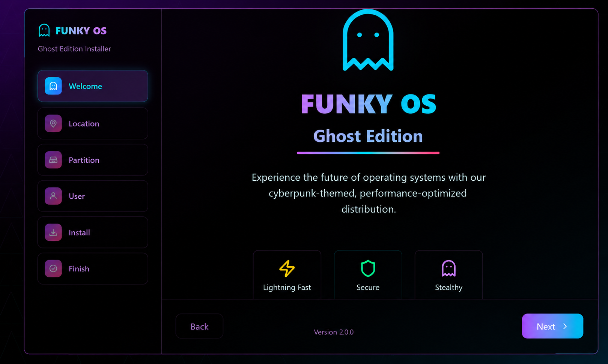
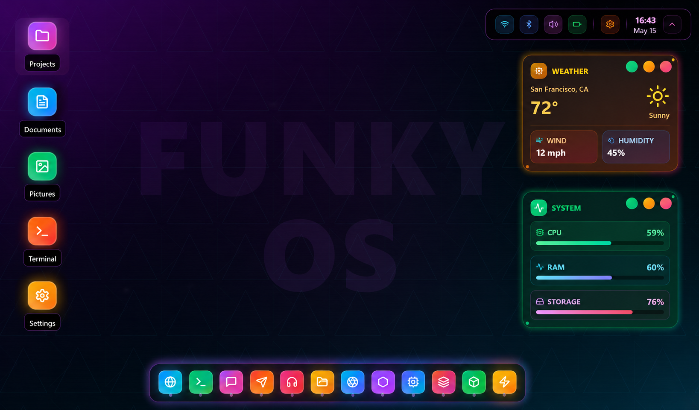
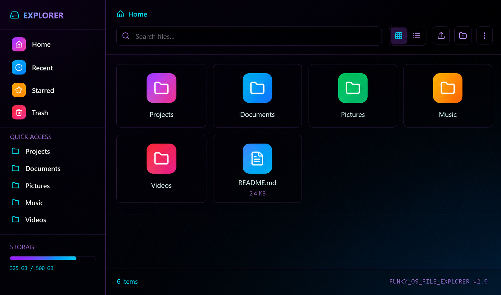
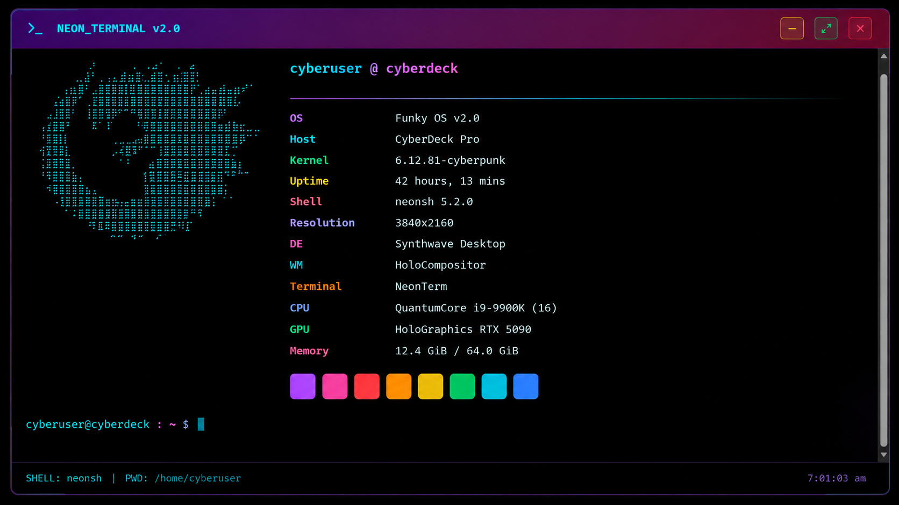

# 🛸 FunkyOS: Ghost Edition
FunkyOS is more than just a custom Linux ISO; it’s a statement on Digital Sovereignty. It’s the result of taking the raw power of Arch Linux and molding it into a portable, "Ghost" workstation that fits in your pocket but performs like a primary OS.

# 📦 Features
- **Live-First**: Boot directly into a fully functional environment without installing.
- **Ghost**: Run without touching the host system, ensuring data and privacy.
- **Portability**: Boot from a USB drive, SSD, or even a virtual machine.
- **Minimal**: A lightweight, yet powerful, Linux distribution.
- **Customizable**: Easily modify and extend with your favorite tools and packages.
- **Intel & AMD Support**: Compatible with both Intel and AMD processors.
- **Security**: Built with security in mind, including encrypted storage and secure boot options.

# 📸 Screenshots












# 🔭 Vision & Architecture
FunkyOS is designed as a "Live-First" environment. It solves the common "Switch Root" and "Label Mismatch" issues found in custom ISOs, creating a seamless boot experience across Intel and AMD architectures.

# 🏎️ Performance Engine
CachyOS Core: Integrated CachyOS repositories for v3/v4 x86_64 optimizations.

Universal Driver Stack: Pre-loaded firmware for Broadcom, Realtek, and major GPU vendors.

Zen-Kernel Speed: Optimized task scheduling for low-latency desktop use.

# 👻 Ghost Features
Hardened Firefox: Pre-baked user.js for zero-telemetry browsing.

DNSCrypt: Automatic DNS encryption out of the box.

Clean Sidebar: Fully portable configurations that leave no trace on host machines.

# 🛠️ Build Information
1. Trusted Keyring Setup
Before building, you must authorize the repository keys on your host machine to avoid signature errors:

```bash
sudo pacman-key --recv-keys F3B607488DB35A47 --keyserver keyserver.ubuntu.com
sudo pacman-key --lsign-key F3B607488DB35A47
```

2. Execution
```Bash
# Clean previous build artifacts
sudo rm -rf work/
```

# Generate the ISO
```bash
sudo ./mkiso.sh
```

# 🚀 Getting Started
To get started with FunkyOS, follow these simple steps:

1. Download the latest ISO file from the [releases page](https://github.com/funkyos/ghost/releases).
2. Burn the ISO to a USB drive or install it on a virtual machine.
3. Boot from the USB drive or virtual machine and enjoy your "Ghost" Linux environment.


🗄️ System SpecsCategoryComponentBaseArch LinuxKernelCachyOS / ZenWMHyprland (Wayland)ShellZsh / FishBarCustom WaybarInstallerBranded Calamares

🤝 Credits
CachyOS Team for the optimized infrastructure.

ArchISO for the build framework.

Hyprland Community for the compositor.
